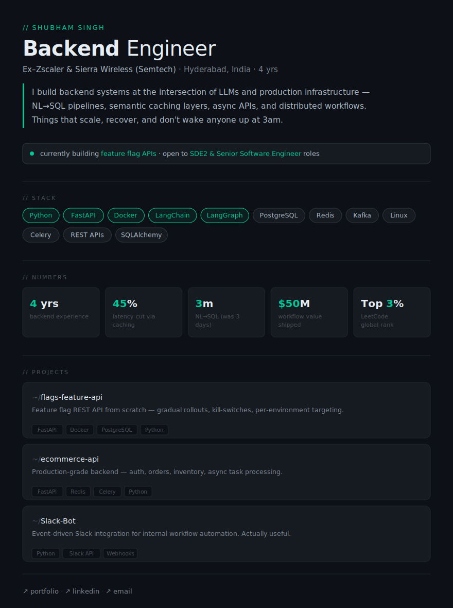

  

<h3 align="center">Projects</h3>

  <a href="https://github.com/sxcluzive/flags-feature-api">flags-feature-api</a>
  &nbsp;·&nbsp;
  <a href="https://github.com/sxcluzive/ecommerce-api">ecommerce-api</a>
  &nbsp;·&nbsp;
  <a href="https://github.com/sxcluzive/Slack-Bot">Slack-Bot</a>
  &nbsp;·&nbsp;
  <a href="https://github.com/sxcluzive/Restaurant-Management">Restaurant-Management</a>

  <a href="https://shubhxcluzive.vercel.app">↗ Portfolio</a>
  &nbsp;·&nbsp;
  <a href="https://leetcode.com/u/shubhxcluzive">↗ LeetCode (Top 3%)</a>
  &nbsp;·&nbsp;
  <a href="https://linkedin.com/in/shubhxcluzive">↗ LinkedIn</a>
  &nbsp;·&nbsp;
  <a href="mailto:shubh.message@gmail.com">↗ Email</a>

